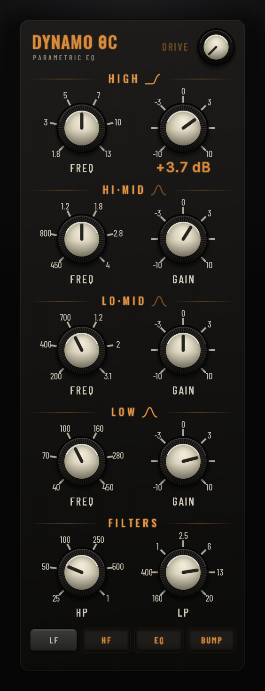
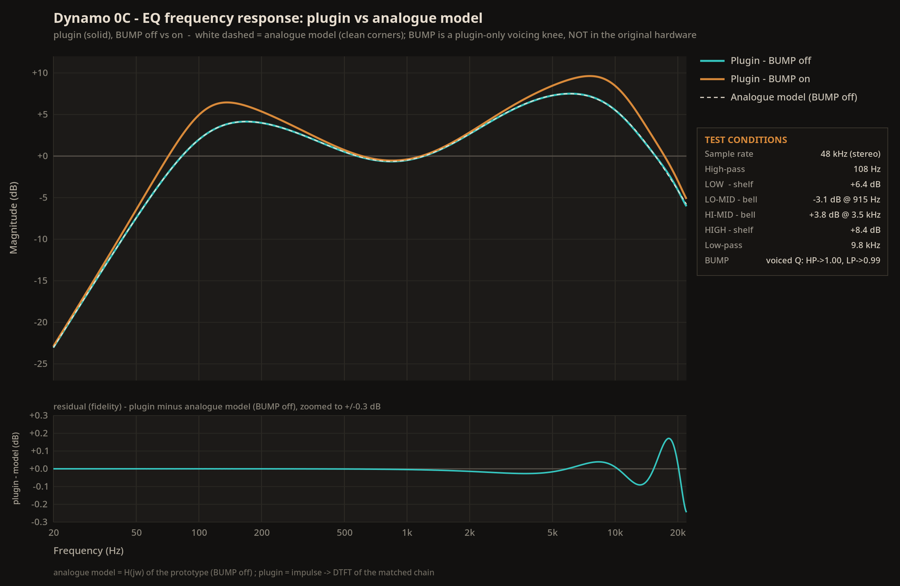
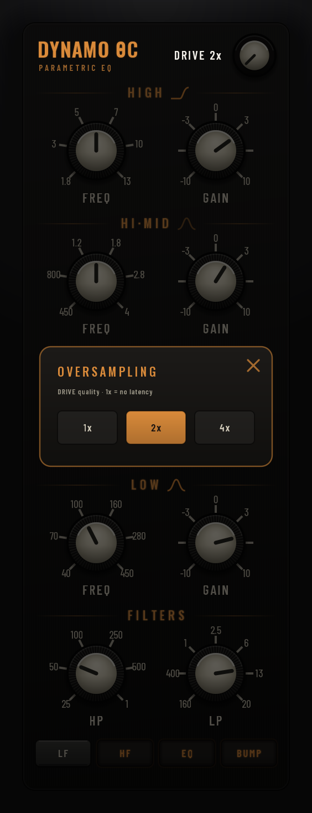

# Dynamo 0C EQ

<p align="center"></p>

Dynamo 0C is a warm, console-style **4-band parametric equaliser** that runs on
Linux as a stereo **LV2** plugin, with its own hardware-style interface. Its
voicing is inspired by the EQ of a famous vintage 32-channel mixing console. It
pairs four proportional-Q bands with high/low-pass filters and an asymmetric,
analogue-style channel drive — the kind of gentle colour a console adds before
you've touched a single control.

---

> **Full disclosure: This plugin was vibe-coded.**
>
> Dynamo 0C was developed by a musician/audio engineer ([NiLace](https://github.com/NiLace)) directing [Claude](https://claude.ai) (Anthropic's AI) through natural language conversation. The author described what the plugin should do, how it should sound, and how it should look. Claude wrote the C code, the DSP algorithms, the UI rendering, the build system, and this README.
>
> The author is not a programmer. Every line of code in this project was generated by AI, then tested and validated by the author in real-world audio production with [Ardour](https://ardour.org) on Linux.
>
> If AI-generated code is a concern for you, this is your notice. The plugin works and it sounds good — but you should know how it was made.

---

## What it does

Every band and filter comes from an analogue `H(s)` prototype, so the curves keep
their analogue shape right up to Nyquist instead of pinching in ("cramping") near
the top the way a naïve digital EQ does. The whole thing is voiced to feel like
turning knobs on a desk rather than dialling numbers into a plugin: smooth,
forgiving, hard to make sound harsh.

<p align="center"></p>

The curve above is a full EQ pass with the high-pass and low-pass filters engaged.
The plugin (solid) sits right on top of the analogue model it's built from (white
dashed) — they agree to well under 0.3&nbsp;dB across the whole spectrum. Notice the
dashed reference is drawn only for the clean state: the modelled circuit's filter
corners are flat.

The **BUMP** switch adds the resonant knee you can see at the two filter corners
(the orange curve). This is a **plugin-only voicing option, not part of the original
hardware** — the modelled unit has no such corner resonance. BUMP is just a gentle
extra lift for when you want a little more punch and edge; leave it off for the
faithful, clean response.

### The four bands

**Low · Lo-Mid · Hi-Mid · High**, each with frequency and gain. They're
**proportional-Q**: a small boost or cut is wide and gentle, and the band tightens
on its own as you push the gain harder. So modest moves stay broad and musical —
good for shaping the overall tone of a track — while bigger moves get focused
enough to chase a specific resonance, all without a separate Q control to manage.

That self-tightening is gentle, and the Q never strays far: across the whole gain
travel it stays between roughly **0.4 and 0.6**. The broadest setting is a small
move — Q ≈ 0.4, a couple of octaves wide — and pushing all the way to maximum boost
only narrows it to about 0.58 (a full cut tightens a touch less). Even at its
narrowest it stays wider than a textbook bell (Q ≈ 1) or a Butterworth (Q ≈ 0.71),
and the value depends only on gain, not on where you set the frequency. So the band
always reads as broad and musical — it focuses, but it never becomes a surgical notch.

- **Low** and **High** can be **bell** or **shelf** (see below).
- **Lo-Mid** and **Hi-Mid** are always **bell** — the midrange workhorses.

### Bell vs shelf

This is the choice on the **Low** and **High** bands (the `LF` / `HF` switches, or
the clickable icon in each band header):

- A **bell** boosts or cuts a hump *centred* on the frequency you dial, tapering
  off on both sides. It works on one region and leaves the extremes alone — lift
  presence around 3–5 kHz, tame boxiness in the low mids, find the body of a kick.
- A **shelf** raises or lowers *everything past* the corner. A **high shelf** tilts
  the entire top end up or down (air, brightness, sheen); a **low shelf** does the
  same for the bottom (weight, warmth). It's a broad tonal tilt rather than a
  targeted bump, and it carries on out to the edge of the spectrum.

Rule of thumb: a **bell** to fix a spot, a **shelf** to tilt the overall balance.

### High-pass and low-pass

- **HP** clears out the lows below its corner — rumble, proximity, mud.
- **LP** rolls off the highs above its corner — fizz, hiss, harsh top.

Each one engages as you turn it in from its "off" end, so the knob position *is*
the amount of filtering. The **BUMP** switch swaps the perfectly smooth roll-off
for a gentle **resonant lift right at the corner** of *both* filters at once — a
little extra punch at the high-pass corner (about +1.5 dB) and a touch of edge at
the low-pass one. Off, both knees are clean (Butterworth); on, both pick up that
resonant character together.

### Channel drive

An asymmetric, analogue-style **input drive** — bounded soft saturation followed
by a DC blocker. It adds a mix of even and odd harmonics (the asymmetry is what
brings in the even ones), which reads as gentle thickness and warmth rather than
obvious distortion — the colour a console lends just by passing signal through it.
It's **bypassed at zero** and switches in the instant you move it; turn it up for
more. At its nominal setting it's a subtle sheen, not a fuzzbox.

## The front panel

All continuous controls are knobs with a live read-out (Hz / kHz / dB); gain
knobs sit at centre for 0 dB.

- **The title** (“DYNAMO 0C”, top-left) is the **bypass**. Click it to engage or
  bypass the whole plugin: lit orange = engaged, plain white = bypassed, and the
  panel dims. It is the one control that still answers while bypassed.
- **Drive**, top right — the input-stage drive. `0` is bypass; higher pushes harder.
  Its **DRIVE** label is also a control — see the settings window below.
- **High / Hi-Mid / Lo-Mid / Low** — frequency and gain per band. On **High** and
  **Low** the bell/shelf icon is clickable (as are the `LF` / `HF` switches).
- **Filters** — the **HP** and **LP** knobs.
- The switch bank along the bottom: **LF** / **HF** (bell ↔ shelf for Low / High),
  **EQ** (engage the four bands) and **BUMP** (the resonant knee on both filters).

Drag a knob up or down to set it; hold **Shift** while dragging for **fine
adjustment**, and **double-click** a knob to snap it back to its default. The
window is resizable; the panel scales uniformly and letterboxes.

### The settings window

<p align="center"></p>

**Click the DRIVE label** (the word “DRIVE”, next to the drive knob) to open the
settings window: a small card slides over the panel and dims it. Click the **✕**, or
anywhere outside the card, to close it.

For now it holds a single setting — **Drive Oversampling** — which controls how the
non-linear channel drive is anti-aliased. Whatever you pick, the **DRIVE label tells
you where you are**: it reads plain `DRIVE` at 1x, and `DRIVE 2x` / `DRIVE 4x` once
oversampling is on — so a setting that costs latency is never hidden behind a click.

- **1x** — the drive runs at the session rate. No added latency; identical to how the
  drive has always sounded. The default.
- **2x / 4x** — the drive is internally run at twice or four times the rate, which
  pushes the aliasing its harmonics would otherwise fold back down well below the
  noise floor. This only kicks in **while the drive is engaged**, and adds a small,
  automatically-reported latency (the host compensates for it) only then.

The **EQ itself is never oversampled** — its bands are analogue-matched so they keep
their shape up to Nyquist without it, at zero latency. So the only oversampling worth
a control is the drive's, and that's what lives here.

## Installing it

The easy way — no compiler needed. Grab the prebuilt bundle from the
[**Releases**](https://github.com/NiLace/Dynamo0C/releases) page and drop it into
your personal LV2 folder:

```sh
mkdir -p ~/.lv2
tar -xzf dynamo-0c.lv2.tar.gz -C ~/.lv2/
```

That leaves `dynamo-0c.lv2/` under `~/.lv2/`. Restart your host (or rescan
plugins) and it shows up as **Dynamo 0C EQ** — in **Ardour** or any other LV2
host (Carla, Qtractor, Zrythm, REAPER with LV2…). To uninstall, delete the
folder. If your host scans a different location, extract there instead (the
system-wide path is usually `/usr/lib/lv2` or `/usr/local/lib/lv2`).

The bundle is a 64-bit x86 build for Linux. What changed in each version is listed
in [`CHANGELOG.md`](CHANGELOG.md).

## Building from source

You'll need a C compiler and the LV2 development headers, plus Cairo, Xlib and
FreeType for the interface. `pugl` is vendored under `deps/pugl`, so the plugin
is self-contained.

```sh
make                              # plugin + UI (the interface is built by default)
make install LV2DIR=$HOME/.lv2    # installs to ~/.lv2/dynamo-0c.lv2/
```

Build the DSP only (no interface) with `make BUILDUI=no` / `make install BUILDUI=no`.

## Third-party components

- **pugl** (`deps/pugl/`) — a minimal portable API for embeddable GUIs, ISC
  License (see `deps/pugl/COPYING`).
- **Fonts** (`fonts/`) — Oswald, Barlow Condensed and Inter, under the SIL Open
  Font License 1.1 (full text and copyright notices in `fonts/OFL.txt`). They
  stay under the OFL and are not relicensed under the GPL.

## How this was made, and the license

This plugin was built mainly with **Claude Code** (Anthropic's AI coding agent),
working from my direction on the DSP, the design, and the testing. I can read C,
but I have not reviewed every line by hand — so please treat it accordingly:

- **No warranty.** It works in my own testing, but it carries no guarantees of
  any kind.
- **No support.** This is a personal project; I can't promise help, fixes, or
  answers.
- **Help is welcome.** If you read code, spot bugs, or want to improve it, review
  and contributions are genuinely appreciated — that's a big part of why it's open.

Released under the **GNU General Public License v3.0 or later** — see
[`LICENSE`](LICENSE).

## Author

Made by **NL Sounds** — <https://github.com/NiLace> · nilace@nylarea.com

---

_Dynamo 0C is an independent project. It is not affiliated with, endorsed by, or
derived from the products of any mixing-console manufacturer; any resemblance is
a matter of tone and inspiration only._
